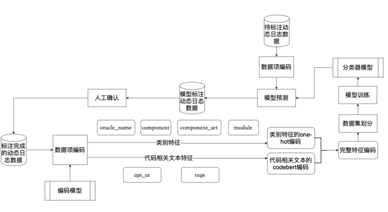

# 动态日志缺陷预测项目——项目方案与过程输出件说明

# 一、项目方案概述

本项目面向动态日志场景，设计并实现了一套基于文本语义与结构化特征融合的日志缺陷预测模型，用于自动识别日志中的误报与真实缺陷，从而提升缺陷检测效率并降低人工成本。

## 1.1 技术路线

系统整体流程如下：

```
动态日志数据（CSV）
        ↓
数据预处理
        ↓
特征编码（One-Hot + CodeBERT）
        ↓
特征融合
        ↓
分类模型（MLP）
        ↓
预测结果输出
```

[https://www.notion.so](https://www.notion.so)



## 1.2 与中期方案关系说明（重点）

### （1）中期方案保持一致内容

本阶段动态日志项目与中期方案保持一致的核心部分包括：

### ① 数据建模方式（完全一致）

- 输入：CSV日志数据
- 输出：结构化 + 文本特征融合

### ② 特征处理方式（完全一致）

- One-Hot 编码（类别特征）
- CodeBERT 编码（文本特征）
- 特征拼接（融合输入）

### ③ 模型结构（完全一致）

```python
MLP（LogClassifier）
```

- 单隐藏层结构
- 二分类输出

### ④ 训练流程（完全一致）

```
数据加载 → 划分训练/测试 → 训练模型 → 保存模型
```

### （2）本阶段优化内容（轻量优化）

相较中期方案，本阶段主要优化：

### ① 工程结构优化

- 模块拆分更清晰
- 增加数据处理与推理模块划分

### ② 推理流程标准化

- 支持统一输入 CSV 推理
- 输出概率结果

### ③ 模型部署能力增强

- 支持服务化接口调用
- 支持在线推理

# 二、过程输出件说明

## 2.1 输出件组成

动态日志项目过程输出件包括：

```
代码工程 + 数据处理模块 + 模型文件 + 编码器 + 推理程序
```

## 2.2 输出件分类

| 类型 | 内容 |
| --- | --- |
| 数据处理 | CSV → 特征编码 |
| 模型训练 | MLP分类器 |
| 推理模块 | CSV预测 |
| 编码器 | OneHot + CodeBERT |
| 服务接口 | API调用 |

# 三、代码工程结构说明

## 3.1 项目总体结构

```
dynamic_log_project/
│
├── data/                  # 数据目录
│   ├── raw/               # 原始CSV数据
│   ├── processed/         # 处理后数据
│
├── model/                 # 模型定义
│   └── log_classifier.py
│
├── preprocess/            # 数据处理模块
│   ├── data_processor.py
│   ├── feature_encoder.py
│
├── train/                 # 模型训练模块
│   └── train.py
│
├── infer/                 # 推理模块
│   └── infer.py
│
├── service/               # 服务接口（可选）
│   └── service.py
│
├── encoder/               # 编码器文件
│   ├── encoder.pkl
│   └── encoder_columns.npy
│
├── codebert/              # 预训练模型
│
└── requirements.txt
```

# 四、核心模块说明

## 4.1 数据处理模块（preprocess）【中期一致】

功能：

- CSV读取
- 空值处理
- 字段清洗

## 4.2 特征编码模块【中期一致】

### （1）结构化特征编码

```
oracle_name
sut.component
sut.module
...
```

处理方式：

```
OneHotEncoder
```

### （2）文本特征编码

字段：

```
api_ut
tags
```

处理方式：

```
CodeBERT → 768维向量
```

### （3）特征融合

```
OneHot + api_ut + tags
```

## 4.3 模型模块（model）【中期一致】

```python
nn.Linear → ReLU → nn.Linear
```

特点：

- 轻量
- 易部署
- 快速推理

## 4.4 训练模块（train）【中期一致】

功能：

- 数据划分
- 模型训练
- 模型保存

## 4.5 推理模块（infer）【优化】

功能：

- 加载模型
- 加载编码器
- 预测结果输出

# 五、关键输出文件

## 5.1 数据输出

| 文件 | 说明 |
| --- | --- |
| processed_data.csv | 处理后数据 |

## 5.2 模型输出

| 文件 | 说明 |
| --- | --- |
| log_classifier.pt | 分类模型 |

## 5.3 编码器输出

| 文件 | 说明 |
| --- | --- |
| encoder.pkl | OneHot编码器 |
| encoder_columns.npy | 特征列顺序 |

## 5.4 推理结果

| 文件 | 说明 |
| --- | --- |
| inference_results.csv | 预测结果 |

# 六、数据与模型关系说明

## 6.1 特征依赖关系

```
CSV → 特征编码 → 模型输入
```

## 6.2 编码器绑定关系（关键）

```
模型 ↔ encoder.pkl ↔ encoder_columns.npy
```

必须保持一致，否则：

- 推理失败
- 维度错误

# 七、训练流程说明

## 7.1 流程

```
加载数据
↓
数据划分
↓
模型训练
↓
保存模型
```

## 7.2 特点

- 单轮训练（无迭代采样）
- 全量数据训练

# 八、推理流程说明

## 8.1 流程

```
输入CSV
↓
特征编码
↓
模型预测
↓
输出结果
```

## 8.2 输出

```
pred_label
prob_0
prob_1
```

# 九、总结

本项目在中期提出的动态日志缺陷预测方法基础上，保持了数据处理、特征编码与模型结构等核心技术路线不变，对工程结构进行了优化整理，并完善了模型推理与部署能力。

在过程输出方面，形成了完整的代码工程体系，包括数据处理模块、特征编码模块、模型训练模块及推理模块，并输出标准化的模型文件与编码器文件，能够支持模型的训练与推理，具备良好的工程可复用性与实际应用价值。